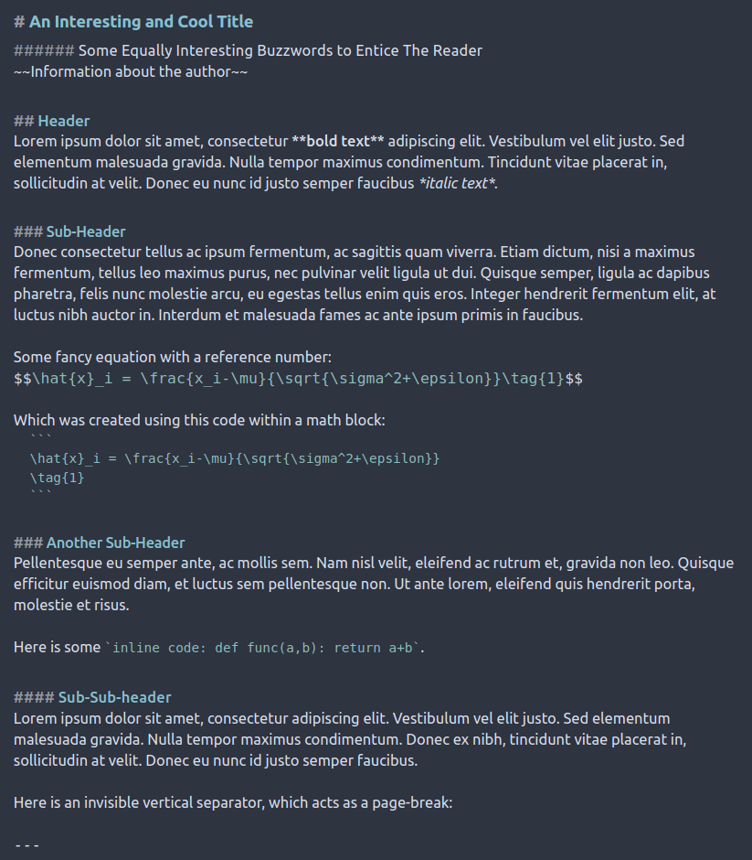
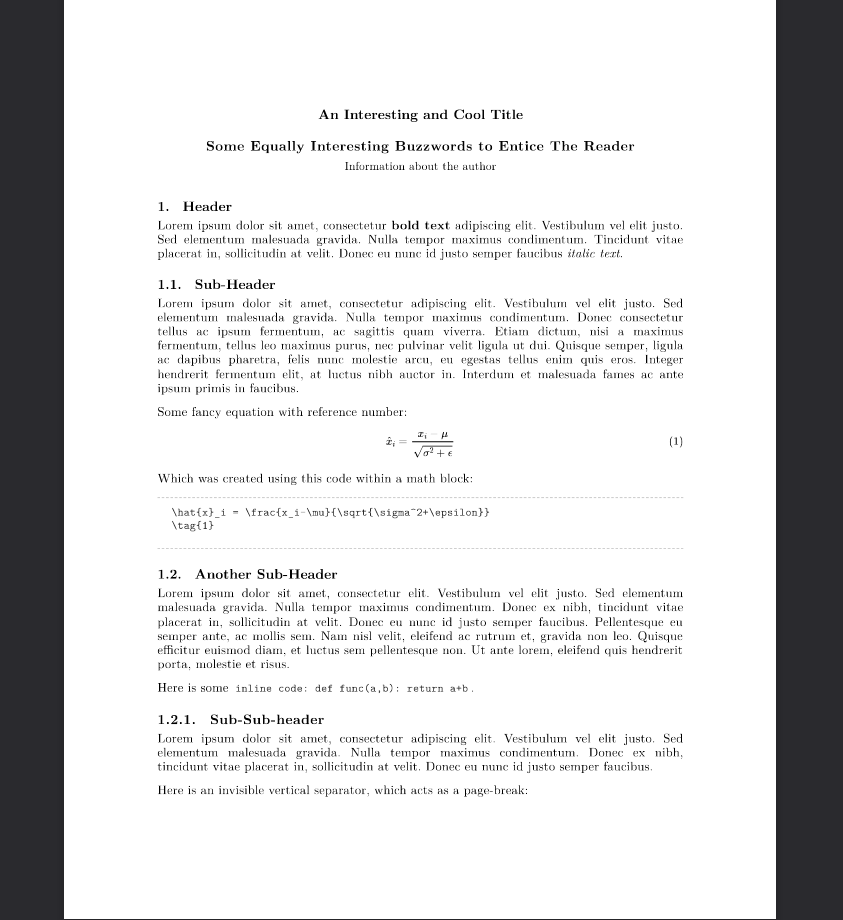
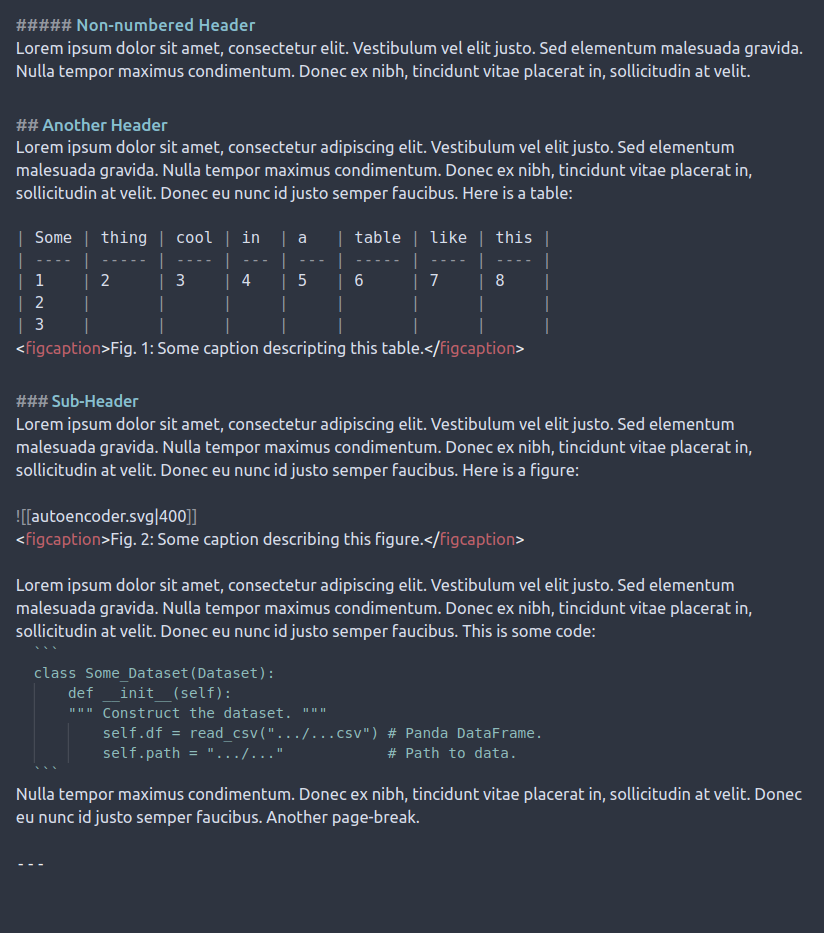
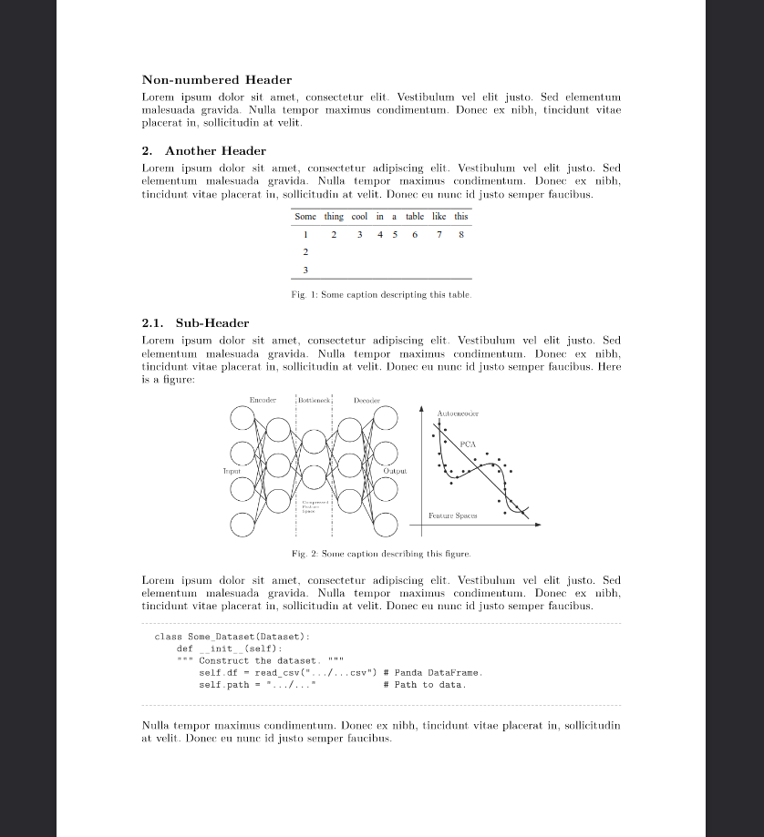
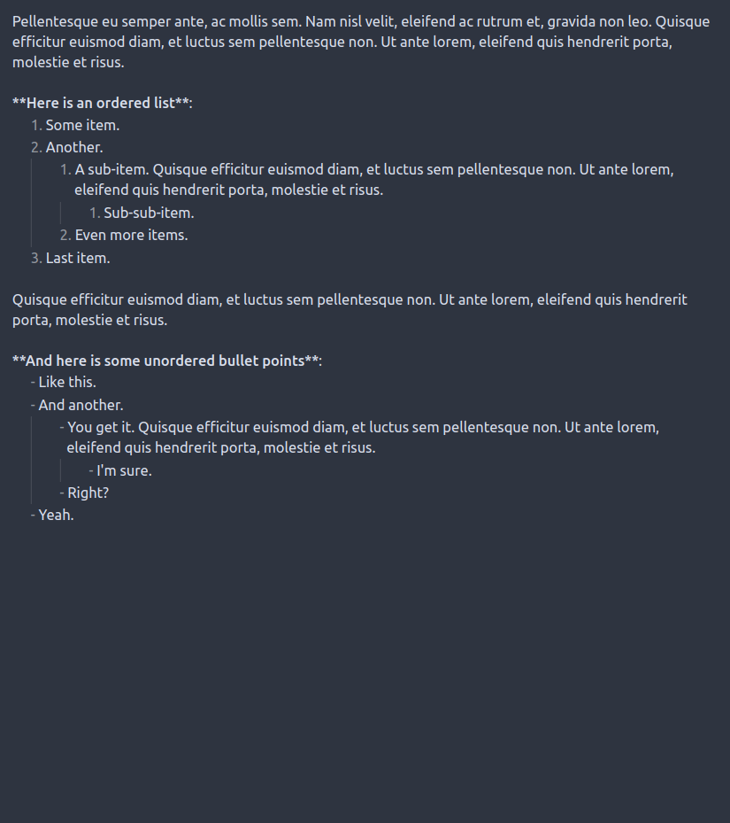
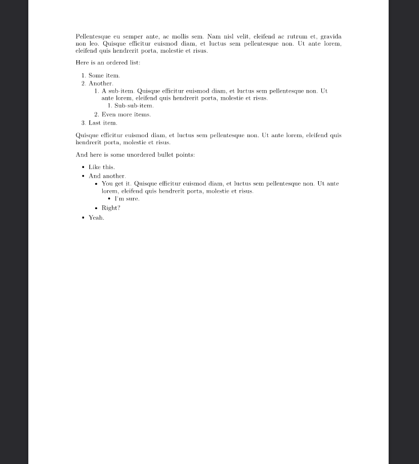

# Obsidian Acadamic Export
**NEW**: If you are interested in making your academic writing easier, take a look at [this project](https://github.com/NicklasVraa/Latex_class_abstractions), which was made to address the limitation of this snippet-based approach.

Here you will find an Obsidian css-snippet, which will format pdf-exports as academic writing akin to LaTeX compilation. Simply place `academic-pdf-export.css` in your obsidian snippets folder and activate it in settings. Check the official [guide](https://help.obsidian.md/Extending+Obsidian/CSS+snippets) for help. Tested with minimal-theme.

Consider this a starting point. Pull-requests and forks are very welcome.

This css-snippet uses the 'Latin Modern' font family - a LateX font clone, which may have to be installed separately, or you can simply change the fonts in the css to something else, e.g. 'Times New Roman'.

## Example
To the left is shown obsidian in source mode, i.e. the source code. To the right is the exported pdf.
| Source                           | Build                          |
|----------------------------------|--------------------------------|
|  |  |
|  |  |
|  |  |

`UI-tweaks.css` will make Obsidian preview mode better resemble what is being exported.

---
|  |  |  |
|--|--|--|
|  |  |  |

Bitcoin: `112ggRAZB6ipvV25v5ewnhdXSfyrYujfaF`

---
**LEGAL NOTICE**: This repository, including any and all of its forks and derivatives, may NOT be used in the development or training of any machine learning model of any kind, without the explicit permission of the owner of the original repository.
